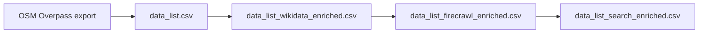

# Pub Tracker — how the London pub database CSV was built

This document describes the **offline data pipeline** used to build and enrich the pub spreadsheet that feeds (or will feed) the Supabase `pubs_all` table. It is written for you when revisiting the project months later, or for anyone auditing where the numbers came from.

---

## 1. Big picture

The app’s pub catalogue is ultimately rooted in **OpenStreetMap (OSM)** pubs inside Greater London. That export is normalised into a single working CSV (`data_list.csv`-shaped schema), then enriched in stages:

1. **Postcodes** — derived from coordinates (UK APIs).
2. **Wikidata** — structured facts where a Wikidata Q-id exists on the row.
3. **Firecrawl + OpenAI** — for rows that **already have a `website`**: scrape the site, extract structured fields and feature chips.
4. **Tavily + OpenAI** — for rows **without** a `website`: web search + extracted text, same extraction shape, plus optional website guess.

Legacy paths (**Tier A** `trafilatura` + `enrich_data_list_from_website_text.py`) exist in the repo but were **superseded** by Firecrawl for accuracy on modern pub sites.



---

## 2. OpenStreetMap — the geographic backbone

**Script:** `scripts/fetch_osm_london_pubs.py`

**What it does**

- Queries the public **Overpass API** (no key) for every OSM element with `amenity=pub` inside a bounding box (default: Greater London).
- Includes **nodes**, **ways**, and **relations**; ways/relations get a representative point via `out center`.
- Does **not** include `amenity=bar` or `amenity=nightclub` (different tags; some venues may be mis-tagged in OSM).

**Outputs (default)**

| File | Purpose |
|------|---------|
| `data/osm_london_pubs.json` | Raw Overpass response + summary |
| `data/osm_london_pubs.csv` | Flat table for spreadsheets / downstream tools |

**Typical command**

```bash
cd /path/to/pub-tracker
python3 scripts/fetch_osm_london_pubs.py
```

**Note:** Large queries can time out; the script documents mirror endpoints and `--timeout`.

---

## 3. Postcode columns from lat/lon

**Script:** `scripts/rebuild_osm_postcodes_csv.py`

**What it does**

- Renames overflow opening-hours columns to `opening_hours_a`, `opening_hours_b`, …
- Inserts / recomputes **`calc_postcode`**, **`calc_postcode_district`**, **`calc_postcode_area`** from **lat/lon** via the UK **postcodes.io** bulk API (every row is recomputed).

**Typical use**

```bash
python3 scripts/rebuild_osm_postcodes_csv.py --input data/osm_london_pubs.csv --in-place
```

These calculated fields align with how the app reasons about **postcode districts** and **areas** for stats and map layers (see `CLAUDE.md` / SQL migrations).

---

## 4. `data_list.csv` — the master spreadsheet shape

**File:** `data/data_list.csv`

This is the **canonical column layout** for one row per pub: OSM identity (`osm_type`, `osm_id`, composite `id` like `node/123`), **lat/lon**, **name**, address parts, **website**, **wikidata**, opening hours columns, feature booleans, photos, operator, founded, description, etc.

**How it relates to OSM**

The repo does not contain a single “OSM → data_list” merge script checked in as the only path; in practice **`data_list.csv` is built or maintained from the OSM export** (and any manual fixes / Wikidata links you add) so that it matches the columns the app and enrichment scripts expect. Treat `data_list.csv` as the **editable source of truth** before Wikidata and Firecrawl layers.

**Useful cross-checks (optional)**

- `scripts/compare_osm_to_app_pubs.py` — compares `data/osm_london_pubs.csv` to live **`pubs_all`** in Supabase (distance + name), useful after import.
- Other comparison scripts (e.g. FSA) exist for hygiene checks.

---

## 5. Wikidata enrichment

**Script:** `scripts/enrich_data_list_from_wikidata.py`

**Input:** `data/data_list.csv` (default)  
**Output:** `data/data_list_wikidata_enriched.csv` (default), or `--in-place`

**Requirements:** Python stdlib only; HTTPS to `www.wikidata.org`. A proper **User-Agent** is required (see script constant / policy).

**Policy (important)**

- **Only fills empty cells** (after strip). Existing OSM or manual values are **never** overwritten.
- **Website (P856):** only if `website` is empty.
- **Description:** English Wikidata **description** (short) → empty `description` unless `--no-fill-description`.
- **Operator:** from Wikidata into `operator` only.
- **Photo:** **P18** only → `photo_url1` if no photo column already set (policy in script header).
- **Address (P6375):** may split into `addr_housenumber` / `addr_street` when both empty.
- **Phone (P1329), founded (P571), English label → name** when targets empty.
- **Lat/lon** are not overwritten from Wikidata.

This stage is cheap and authoritative where a Q-id exists; coverage is limited by how many London pubs are linked in OSM/Wikidata.

---

## 6. Website scraping + LLM — Firecrawl path (pubs **with** a website)

**Script:** `scripts/enrich_pub_data_firecrawl.py`

**Replaces:** `scripts/fetch_pub_websites_tier_a.py` + `scripts/enrich_data_list_from_website_text.py` for production-quality website text (JS rendering, fewer hard 403s).

**Dependencies:** `scripts/requirements_firecrawl.txt` (e.g. `firecrawl-py`, `openai`, `python-dotenv`)

**Environment (`.env`)**

- `FIRECRAWL_API_KEY`
- `OPENAI_API_KEY`
- Optional: `PUB_CONFIDENCE_THRESHOLD` (default used by script for accepting extracted values)

**Typical flow**

```bash
# From Wikidata-enriched input → Firecrawl-enriched output
.venv-firecrawl/bin/python scripts/enrich_pub_data_firecrawl.py \
  --input data/data_list_wikidata_enriched.csv \
  -o data/data_list_firecrawl_enriched.csv
```

**Behaviour**

- For each row with a **non-empty `website`**, Firecrawl **scrapes** that URL and returns **markdown**.
- **OpenAI** (configurable model, e.g. `gpt-5.4-nano-2026-03-17`) returns strict JSON: description, phone, founded, operator, feature YES/NO/UNKNOWN + confidences, optional quality flags.
- **UK phone normalisation** in Python (`normalize_phone_uk`).
- **Writes only into empty** data cells for the main fields; **confidence columns** are written for audit even when the value already existed.
- **`fc_*` columns** (Firecrawl scrape run): `fc_status`, `fc_error`, `fc_quality_flags`, `fc_quality_note`, etc.

**Incremental runs**

- `--limit` / `--sample` + `--seed` for batches.
- `--exclude-fc-ok` to skip rows already successfully scraped (`fc_status=ok`).

**Credits:** Firecrawl charges **per successful page scrape** (see Firecrawl pricing); budgeting is per pub with a website.

---

## 7. No-website pubs — Tavily search + LLM

**Script:** `scripts/enrich_search_pubs.py`

**Why:** A large fraction of OSM pubs have **no `website`**. Firecrawl cannot scrape a URL that does not exist. Tavily runs a **search** (basic depth, **1 API credit per query** on the free tier) with **`include_raw_content=True`** so each hit includes usable page text, not only snippets.

**Dependencies:** `tavily-python`, `openai`, `python-dotenv` (same venv as Firecrawl is fine)

**Environment**

- `TAVILY_API_KEY`
- `OPENAI_API_KEY`

**Typical commands**

```bash
# Test sample
.venv-firecrawl/bin/python scripts/enrich_search_pubs.py \
  -i data/data_list_firecrawl_enriched.csv \
  -o data/data_list_search_enriched.csv \
  --limit 10 --seed 1

# Full run (all rows where website is still empty)
.venv-firecrawl/bin/python scripts/enrich_search_pubs.py \
  -i data/data_list_firecrawl_enriched.csv \
  -o data/data_list_search_enriched.csv
```

**Eligibility**

- Only processes pubs where **`website` is empty** (after strip). Rows that already had a website from OSM/Wikidata/Firecrawl are **untouched** by this script.

**Behaviour**

- Builds a **search query** from name + address + “London pub”.
- Merges text from top results (preferring non-aggregator domains where possible).
- Same OpenAI JSON schema as the Firecrawl path (adapted prompt for “search result / listing” content).
- **`fcs_*` columns** (historical prefix: “firecrawl search”, now Tavily): `fcs_status`, `fcs_query`, `fcs_source_url`, `fcs_website_guess`, `fcs_website_conf`, quality flags, etc.
- If **`fcs_website_guess`** is above the configured confidence and not an aggregator domain, the script may **fill `website`** for the first time.

**Quality flags**

Stored in `fcs_quality_flags` / `fcs_quality_note`. You can filter in a spreadsheet for serious cases such as **`possible_wrong_pub`** and **`possibly_closed`**. **`name_or_location_mismatch`** is often a cautious false positive on common names (“The Crown”, etc.); data may still be useful.

---

## 8. Legacy Tier A path (optional / historical)

| Script | Role |
|--------|------|
| `scripts/fetch_pub_websites_tier_a.py` | HTTP fetch + **trafilatura** plain text into CSV (`tier_a_excerpt` or sidecar files). |
| `scripts/enrich_data_list_from_website_text.py` | OpenAI enrichment from that plain text. |

**Why deprecated for your pipeline:** Many pub sites block simple scrapers or need JS; success rate was low compared to Firecrawl.

---

## 9. Confidence, “never overwrite”, and what actually lands in the app

- **Empty-only writes** for most enrichment fields: if OSM or Wikidata already set a value, later stages **do not replace it**.
- **Confidence thresholds** (CLI / env): model must exceed the threshold for a field to be written; otherwise the cell stays empty and you keep the lower-risk state.
- **Feature columns** use `TRUE` / `FALSE` when confident; unknown stays empty.
- **Quality flags do not block writes** by default: a row can be `fcs_status=ok` and still list flags — you use flags for **manual review** or for **post-processing** (e.g. drop description if `possible_wrong_pub`).

---

## 10. Moving data into Supabase (`pubs_all`)

The CSV pipeline is **deliberately separate** from the live database: you validate the CSV, then import or upsert into **`pubs_all`** (Postgres via Supabase).

The repo includes various **Supabase-facing** scripts (e.g. `scripts/update_pub_data.py`, spatial assignment generators, image fetchers) that assume `pubs_all` already exists and is populated or updated through **your** chosen import path (SQL `COPY`, dashboard CSV import, or a small custom importer).

**Important:** Map CSV columns to your live schema (including generated UUID `id` vs OSM `id` string) exactly once in your import tooling — this doc does not replace that mapping.

---

## 11. Design choices you already rejected (context)

- **Google Places / Maps Places API:** useful for coverage, but licensing and storage/display rules conflicted with a **non-Google map** app (MapLibre). The pipeline stays on OSM + open/listing web text + LLM extraction.
- **CAMRA WhatPub scraping:** skipped due to IP / terms concerns; not part of this pipeline.

---

## 12. File cheat sheet (data directory)

| File | Role |
|------|------|
| `data/osm_london_pubs.csv` | Raw OSM pub export from Overpass |
| `data/data_list.csv` | Master-shaped working table (OSM-rooted) |
| `data/data_list_wikidata_enriched.csv` | After Wikidata pass |
| `data/data_list_firecrawl_enriched.csv` | After Firecrawl + OpenAI for pubs with websites |
| `data/data_list_search_enriched.csv` | After Tavily + OpenAI for pubs still without a website (typical final handoff for review) |
| `data/data_list_tier_a*.csv`, `data_list_website_enriched.csv` | Legacy Tier A experiments |

Keep occasional **backups** (you already have `*_backup.csv` variants) before long runs.

---

## 13. Quick dependency install (Firecrawl + Tavily + OpenAI)

```bash
cd /path/to/pub-tracker
python3 -m venv .venv-firecrawl
.venv-firecrawl/bin/pip install -r scripts/requirements_firecrawl.txt
```

Ensure `.env` at repo root (and optionally `scripts/.env`) contains the keys referenced above **without committing secrets**.

---

*Last updated to reflect the OSM → Wikidata → Firecrawl → Tavily search pipeline and the `docs/` addition.*
